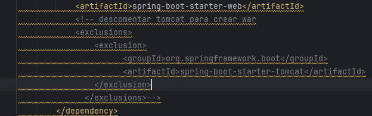
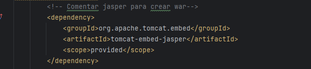
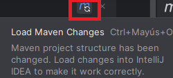
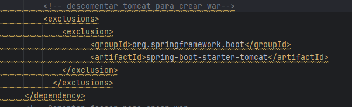
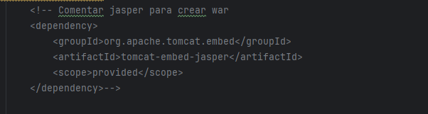
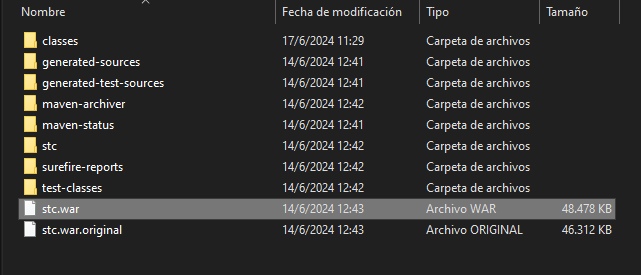
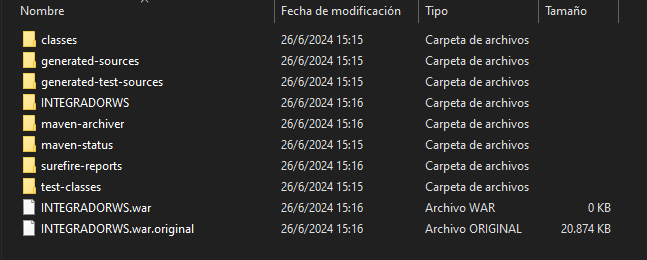

 <p align="center"><a href="#" target="_blank"></a></p>

# Backend

##  Requisitos
  - Herramientas necesarias:
    * Java versión 8 
    * MongoDB version 4.4.29
    * Node versión 15.4.0
    * WildFly versión 18.0.1 - (Importante configurar WildFly como servicio de Windows)
    * IntelliJ IDEA Community Edition

## Contenido

- [1.- Configuraciones de manera local](#1--configuraciones-de-manera-local)

    -[1.1 Levantar Proyecto STC General](#11-levantar-el-proyecto-stc-general)

    -[1.2 Levantar Proyecto Integrador Log](#12-levantar-el-proyecto-integrador-log)
    
    -[1.3 Levantar Proyecto Integrador ARCH](#13-proyecto-integrador-arch)


- [2.- Servidor](#2--servidordeployment)

## 1.- Configuraciones de manera local

---

### 1.1-Levantar el proyecto STC General 

- Revisar si el servicio wildfly está detenido, si está en ejecución proceda a detenerlo.
- Una vez clonado el proyecto de manera local, procedemos abrirlo en el IDE
- Ubicarse en el archivo pom.xml, busque las siguientes dependencia en el cual debe seguir las siguientes instrucciones:

  - Debe tener comentado el tomcat, como se presenta en la siguiente imagen:

    

  - Debe tener descomentado el jasper, como se presenta en la siguiente imagen:

    
    

- Una vez hecho las modificaciones, proceda actualizar el maven.

    

- Finalmente ejecutar el proyecto.

### 1.1.2.- En caso de error al levantar el proyecto

- Abrir la terminal del IDE, escribir los siguientes comandos

```
   rm -r target
   rm .classpath
   rm .project
   mvn eclipse:eclipse

```

- En caso de que no se compile el proyecto, comuniquese con el lider tecnico.

```

```

### 1.1.3 Proceso de creación y ubicación del archivo .war

### 1.1.3.1-Guia para crear Archivo .war

- Detener la API del proyecto antes de proceder con la creación del archivo .war en el siguiente paso.

- Ubicarse en el archivo pom.xml, busque las siguientes dependencia en el cual debe seguir las siguientes instrucciones:

  - Debe tener descomentado el tomcat, como se presenta en la siguiente imagen:

    
  
  - Luego debe comentar el jasper, como se presenta en la siguiente imagen:

    
  
- Una vez hecho las modificaciones, proceda actualizar el maven.

  

- Por ultimo abrir la terminal del IDE, escribir los siguientes comandos

```
   rm -r target
   rm .classpath
   rm .project
   mvn eclipse:eclipse
   mvm clean package
```

### 1.1.3.2 Ubicación del archivo .war

- Una vez hecho el paso anterior, el archivo .war se generará dentro del Api STC en el directorio de target, para más detalles, vea el ejemplo en la siguiente imagen:



- AVISO: La generación del archivo .war puede variar según el ambiente, para ello debe dirigirse al archivo pom.xml, escribir la etiqueta "finalName" y siga las siguientes instrucciones:

  * Para el ambiente de servidor de calidad y local, se especifica con el nombre de "stc".

  * Para el ambiente en fase de producción, se especifica con el nombre de "".

  - Para más detalles, observe la siguiente imagen:


---

### 1.1.4.-Despliegue de archivo .war en WildFly de manera local

---

- Importante detener la api del proyecto
- Debe estar en ejecución el servicio Wildfly
- Seguir las instrucciones del manual en el punto 1.3 que se encuentra en el siguiente URL:

```
https://drive.google.com/file/d/104GB6vxkwW3gItneXXyoz6LIShzNCoVW/view?usp=sharing
```

- Si existe problema al desplegar, dirigirse nuevamente al directorio bin, ubicarse en el archivo "standalone.conf.bat" dar clic en editar, luego busque el parámetro "-XX:MaxMetaspaceSize" y modificarlo al tamaño de "3052m" y guarde los cambios.

- Por ultimo reiniciar el servicio de wildlfy y repita las instrucciones del manual en el punto 1.5 de la seccion de "despliegue del wildfly".

### 1.1.4.1.- En caso de error al deployar

- En caso de seguir con el error, comuniquese con el lider tecnico.

```

```

---

### 1.2.-Levantar el proyecto Integrador Log 

- Revisar si el servicio wildfly está detenido, si está en ejecución proceda a detenerlo.
- Una vez clonado el proyecto de manera local, procedemos abrirlo en el IDE
- Finalmente ejecutar el proyecto.
### 1.2.1.- En caso de error al levantar el proyecto

- Abrir la terminal del IDE, escribir los siguientes comandos

```
   rm -r target
   rm .classpath
   rm .project
   mvn eclipse:eclipse

```

- En caso de que no se compile el proyecto, comuniquese con el lider tecnico.

```

```

### 1.2.2- Proceso para crear Archivo .war
  - Para el proceso de creacion de archivo .war dirigirse al punto -[1.1.3.1 Guia para crear Archivo .war](#1131-guia-para-crear-archivo-war)

### 1.2.3 Ubicación del archivo .war

- Una vez hecho el paso anterior, el archivo .war se generará dentro del Api en el directorio de target, para más detalles, vea el ejemplo en la siguiente imagen:

 

- AVISO: La generación del archivo .war puede variar según el ambiente, para ello debe dirigirse al archivo pom.xml, escribir la etiqueta "finalName" y siga las siguientes instrucciones:

  * Para el ambiente de servidor de calidad y local, se especifica con el nombre de "INTEGRADORWS".

  * Para el ambiente en fase de producción, se especifica con el nombre de "".

  - Para más detalles, observe la siguiente imagen:


---
### 1.2.4.- Despliegue de archivo .war (INTEGRADORWS) en WildFly de manera local
- Dirigirse al punto - [1.1.4 Despliegue de archivo .war de manera local](#114-despliegue-de-archivo-war-en-wildfly-de-manera-local)

### 1.3.-Proyecto Integrador ARCH

- Una vez clonado el proyecto, Abrirlo en el visual studio; luego abrir una nueva terminal y escriba el comando "npm i" para realizar las instalaciones de librerias necesarias.


-  por ultimo para levantar la aplicación, escribir el siguiente comando:
  ```
  node archSoap.js
  ```

## 2.- Servidor(Deployment)

---

- Importante tener conectado la VPN
- Debe estar en ejecución el servicio Wildfly
- Seguir las instrucciones del manual en el siguiente URL:

```
https://drive.google.com/file/d/1UtDTKeJoT0L83zkxVDLSNSeeKgRmvZEF/view?usp=sharing
```
